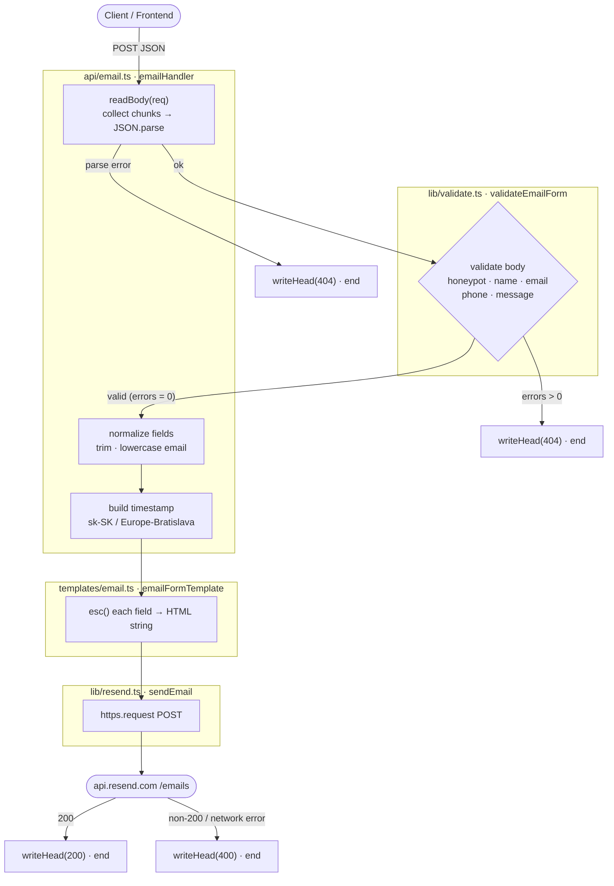

# momentkaph_be

## TypeScript Tooling

Node speaks JavaScript. `tsc` bridges the gap — it type-checks your `.ts` source and emits `.js` files to `dist/`.

```
.ts files  →  tsc  →  dist/*.js  →  node dist/index.js
```

```bash
npm run typecheck   # tsc --noEmit  — type-check only, no files written
npm run build       # tsc           — type-check + emit to dist/
npm run start       # node dist/index.js
npm run fire-up     # typecheck → build → start
```

## Diagrams

### Email

